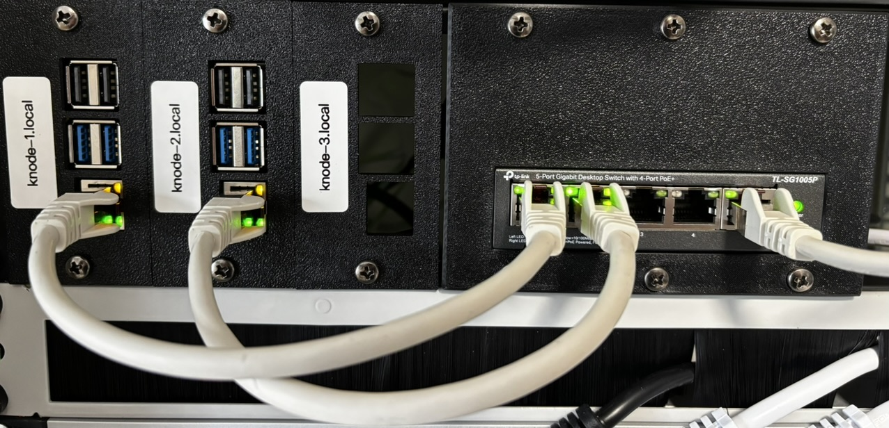
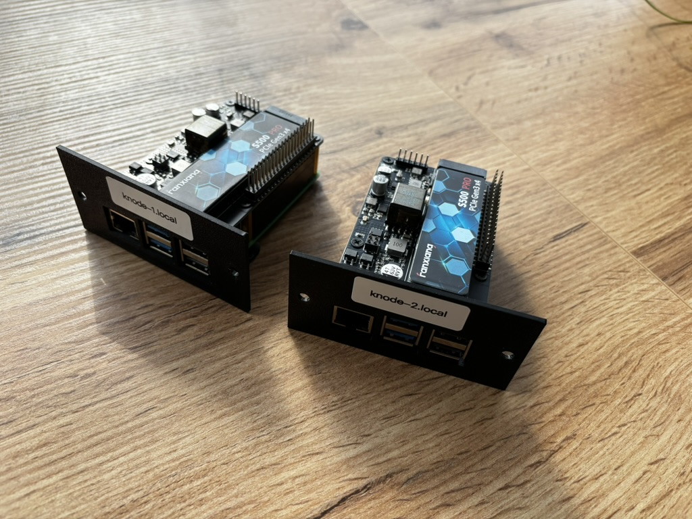
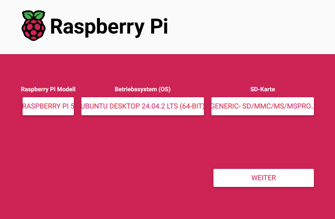

# cluster-on-a-budget

This project will be a short documentation of how I built my small 2-node Raspberry Pi 5 k3s cluster on a small budget with a minimal redundant setup.

My main goal is to get familiar with Kubernetes fundamentals like objects, networking, and storage. I believe that there are many people out there who want the same, which is why I’m sharing this with you.
This documentation is a mix of my personal decisions — what I did and why — and a step-by-step guide for you.

### Right now, this is what the cluster looks like:



As you can see, there are already three slots for an additional Raspberry Pi, which I plan to add once I’m more familiar with the current setup.

## List of Hardware Components

| Name                                | Quantity | Link                                                                                                                                                                                                                                                                                                                                                                                                                                                                                                                                                                                      |
|-------------------------------------|----------|-------------------------------------------------------------------------------------------------------------------------------------------------------------------------------------------------------------------------------------------------------------------------------------------------------------------------------------------------------------------------------------------------------------------------------------------------------------------------------------------------------------------------------------------------------------------------------------------|
| Raspberry Pi 5, 8GB RAM             | 2        | [berrybase.de](https://www.berrybase.de/raspberry-pi-5-8gb-ram?utm_source=google&utm_medium=cpc&gad_source=1&gbraid=0AAAAADSQJK6LI8yI-fNnIvGFkF7u8Rj6d&gclid=CjwKCAjwwe2_BhBEEiwAM1I7sVc4W97qqFND67wHfhJSrcIpbKqMFOGu4-BOTeYzwWLdp0nS_3l7lRoCyA0QAvD_BwE)                                                                                                                                                                                                                                                                                                                                 |
| GeeekPi P33 M.2 NVME M-Key PoE+ Hat | 2        | [amazon.de](https://www.amazon.de/dp/B0D8J7B47N?ref=ppx_yo2ov_dt_b_fed_asin_title&th=1)                                                                                                                                                                                                                                                                                                                                                                                                                                                                                                   |
| Fanxiang M.2 SSD 512GB              | 2        | [amazon.de](https://www.amazon.de/dp/B0B55R7PYB?ref=ppx_yo2ov_dt_b_fed_asin_title&th=1)                                                                                                                                                                                                                                                                                                                                                                                                                                                                                                   |
| 2U DAP rack panel                   | 1        | [musicstore.de](https://www.musicstore.de/de_DE/EUR/DAP-2-HE-Rackblende-f-Modulsystem-10-Segmente-MP-1/art-PAH0017160-000)                                                                                                                                                                                                                                                                                                                                                                                                                                                                |
| TP-Link TL-SG1005P PoE Switch       | 1        | [amazon.de](https://www.amazon.de/dp/B0763TGBTS?ref=ppx_yo2ov_dt_b_fed_asin_title&th=1)                                                                                                                                                                                                                                                                                                                                                                                                                                                                                                   |
| SanDisk 32 GB micro SD card         | 1        | [amazon.de](https://www.amazon.de/SanDisk-microSDHC-Speicherkarte-SD-Adapter-App-Leistung/dp/B08GY9NYRM/ref=sr_1_10?__mk_de_DE=ÅMÅŽÕÑ&crid=2Y06TNE22W65A&dib=eyJ2IjoiMSJ9.wURXrQCPkQt61NVEdL51J61A-TqAQX5eZf7FvhzTxR4haI2kQBZbzO7EcXDhI5WIotIxFnO-IsGhkhwDt0kYmHzFIYIbX6OiKXFFYs56u70AdTT-NyCn9RBso5w9b_wR7va4yOQawWRRK3ODT2m8c7rerbYhi9nl4C_Xnafbsza2uLPjCrvvhxjDJLyAOjPE4NxH60mdSwbWqpAq-mrMByaaNqM3sFmQt6UdWNpccw4.QXt6SAgkGFwJGMmwD-FAF4IehhT2bWYV9SvJzFTUVfc&dib_tag=se&keywords=micro+sd+karte+sandisk&qid=1744556517&sprefix=micro+sd+karte+sandisk%2Caps%2C121&sr=8-10)           |

### Total costs: 395€ / 448$

## Printables

| Name                      | Quantity | Link                                                                                                                                                                                                                                                      |
|---------------------------|----------|-----------------------------------------------------------------------------------------------------------------------------------------------------------------------------------------------------------------------------------------------------------|
| TL-SG1005P Rack Mount     | 1        | [berrybase.de](https://www.berrybase.de/raspberry-pi-5-8gb-ram?utm_source=google&utm_medium=cpc&gad_source=1&gbraid=0AAAAADSQJK6LI8yI-fNnIvGFkF7u8Rj6d&gclid=CjwKCAjwwe2_BhBEEiwAM1I7sVc4W97qqFND67wHfhJSrcIpbKqMFOGu4-BOTeYzwWLdp0nS_3l7lRoCyA0QAvD_BwE) |
| Raspberry Pi 5 Rack-Mount | 2        | [printables.com](https://www.printables.com/model/780897-tl-sg1005p-rack-mount?lang=de)                                                                                                                                                                   |

# The Setup



First, after assembling the components for the Raspberry Pis, I had to create a bootable SD card with [Ubuntu Desktop](https://ubuntu.com/desktop) on my PC to boot the Raspberry Pis.
Later, I’ll need Ubuntu Desktop to make the NVMe drives bootable for the Raspberry Pis.

To make the SD card and NVMe's bootable, I use the [Raspberry Pi Imager](https://www.raspberrypi.com/software/).



After creating the bootable SD card, insert it into the first Raspberry Pi and power it on.
Once the Pi has booted, download the Raspberry Pi Imager again – this time directly on the Pi.

Then use it to flash Ubuntu Server onto the NVMe drive, which will later be used to run the k3s cluster. 
This is also the point where you should set the hostname for the Pi.
I will skip this part in the documentation.
Repeat this step for all other Raspberry Pis.

## Configure static IPs

If you want your Raspberry Pis to use static IPs instead of DHCP (for example, because you don’t have a DNS server to resolve their hostnames for SSH access), you should adjust the network configuration accordingly:

```
# 1. change dhcpcd.conf
sudo nano /etc/dhcpcd.conf

# 2. setup static IP
interface eth0
static ip_address=192.168.1.50/24
static routers=192.168.1.1

# 3. control + X to save changes
```

Repeat this step for all other Raspberry Pis.

## Installing k3s

### Why k3s? (Talos vs k3s)

Before setting up the cluster, I considered a few lightweight options for the setup. Talos OS and k3s made the shortlist.

Unfortunately, Talos OS currently doesn’t support the Raspberry Pi 5, and there’s no community workaround available either — so I went with k3s.
However, a major advantage of k3s is that the nodes can also be used later for purposes other than Kubernetes. For example, for automation, Docker and so on.

### Install the master node

First, choose one of your Raspberry Pis to act as the master node (now called the control plane). It will run the Kubernetes API server and manage the cluster.

Then, on that Pi, run the following:

```
# Update repositories and upgrade existing packages
sudo apt update && sudo apt upgrade -y

# Install curl
sudo apt install curl -y

# Install k3s
curl -sfL https://get.k3s.io | sh -

# Copy the k3s token (you’ll need it for the agent nodes)
cat /var/lib/rancher/k3s/server/node-token
```

This sets up your master node.

The k3s service is now running and managed by systemd. You can check the status with:

```
sudo systemctl status k3s
```

A master node (now called control plane) manages the Kubernetes cluster – it schedules workloads, maintains the desired state, and handles scaling.
An agent node (or worker node) runs the actual applications (pods) and reports back to the control plane.

### Install the agent node(s)

Next, install the agent nodes using the IP address of the master node and the token you copied earlier. Do this on each of your other Raspberry Pis:

```
# Update repositories and upgrade existing packages
sudo apt update && sudo apt upgrade -y

# Install curl
sudo apt install curl -y

# Install k3s and join the cluster (replace <MASTER_IP> and <NODE_TOKEN>)
curl -sfL https://get.k3s.io | K3S_URL=https://<MASTER_IP>:6443 K3S_TOKEN=<NODE_TOKEN> sh -
```

Make sure your master node is reachable from the agent nodes on port 6443.
If you’re using a firewall or NAT, ensure this port is open and accessible.

Once joined, you can check the cluster status on the master node with:

```
kubectl get nodes
```


